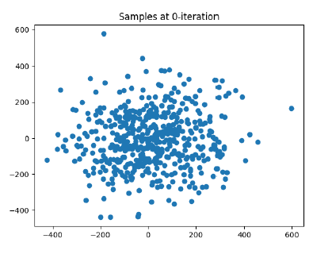
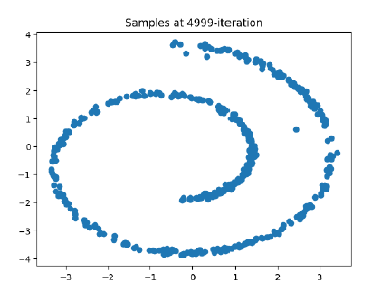
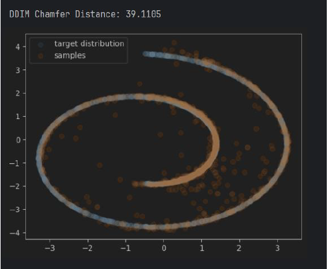
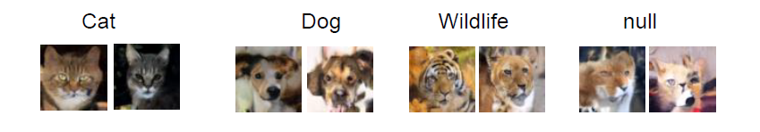
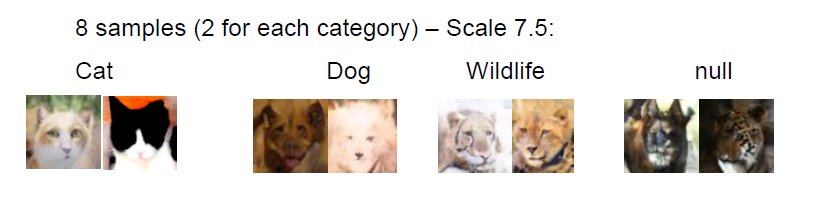
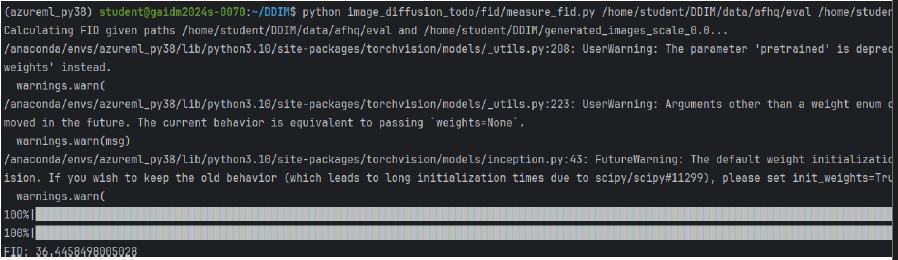

# Homework 4 — Score-Based Diffusion (2D) & Image Diffusion with CFG + FID Evaluation

This assignment includes two related but independent components:

1. **2D Diffusion & DDIM Sampling**  
   `HW4_318280294_code/2d_plot_diffusion_todo/ddpm_tutorial.ipynb`  
   Demonstrates how diffusion models transform noise into structured data through iterative denoising.  
   Sampling progression and convergence are visualized and evaluated using Chamfer distance.

2. **Image Diffusion with Classifier-Free Guidance (CFG) & FID**  
   `HW4_318280294_code/image_diffusion_todo/fid/fid_todo.ipynb`  
   Generates images conditioned on semantic labels and evaluates perceptual quality using FID across different CFG scales.

All original folder paths are preserved to avoid breaking resource references.

---

## How to Run

### Option A (Recommended)
Run Jupyter from the **repository root**:
```bash
jupyter lab
```
Open each notebook through the file browser.

### Option B (Explicit)
Add at the **first cell** of each notebook:

```python
# For the 2D DDIM notebook:
%cd HW4_318280294_code/2d_plot_diffusion_todo

# For the CFG + FID notebook:
%cd HW4_318280294_code/image_diffusion_todo/fid
```

---

## Part 1 — DDIM Sampling (2D)

### Sampling Progression
| Iteration 0 | Final Iteration (~5000) |
|------------|--------------------------|
|  |  |

### Chamfer Distance (Convergence Measure)


---

## Part 2 — Conditional Image Diffusion with CFG

### Effect of Guidance Strength on Generated Samples

| CFG Scale = 0.0 | CFG Scale = 7.5 |
|-----------------|----------------|
|  |  |

### FID Evaluation
| FID @ 0.0 | FID @ 7.5 |
|----------|-----------|
|  |  |

---

## Preferred Animal Samples (Human Evaluation)

See:
```
HW4_318280294.pdf
```

---

## Reproducibility

To record the environment:
```bash
pip freeze > requirements.txt
```

Ensure to run notebooks from the correct working directory (see instructions above).
